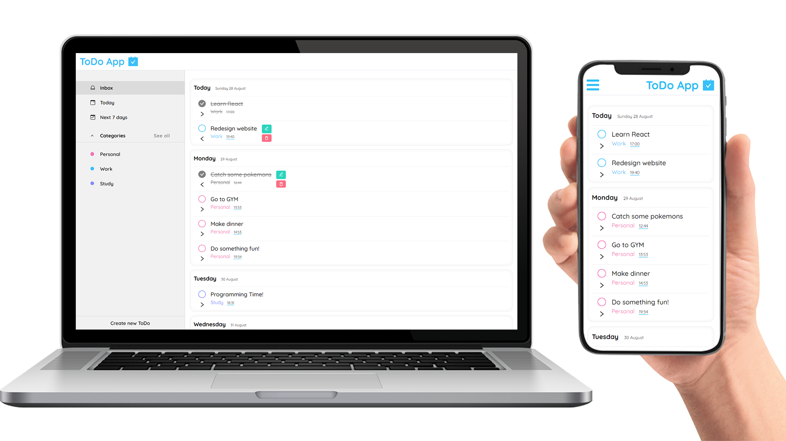

# Todo App in ReactJS

## Table of contents

- [Overview](#overview)
  - [Screenshot](#screenshot)
  - [How to setup](#how-to-setup)
- [My process](#my-process)
  - [Built with](#built-with)
  - [Continued development](#continued-development)

## Overview

### Screenshot

### How to setup

- Run local JSON server
 `npm run server`

- Run Vite
  `npm run dev`

## My process

### Built with

- HTML5
- CSS 
- [React](https://reactjs.org/) - JS library
- [JSON-server](https://github.com/typicode/json-server) - Get a full fake REST API
- [React Router](https://reactrouter.com) - Client-Side Routing
- [Vite.js](https://vitejs.dev) - Frontend Tooling

### Continued development

- remake navbar with logo hamburger menu on mobile that pops-up sidebar, on desktop navbar with only logo and sidebar that is always visable

- create component that lets users create their own category 
